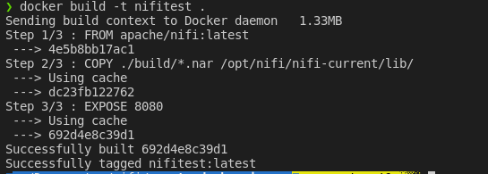
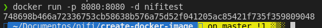
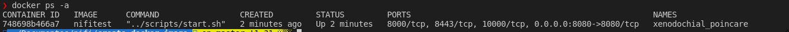
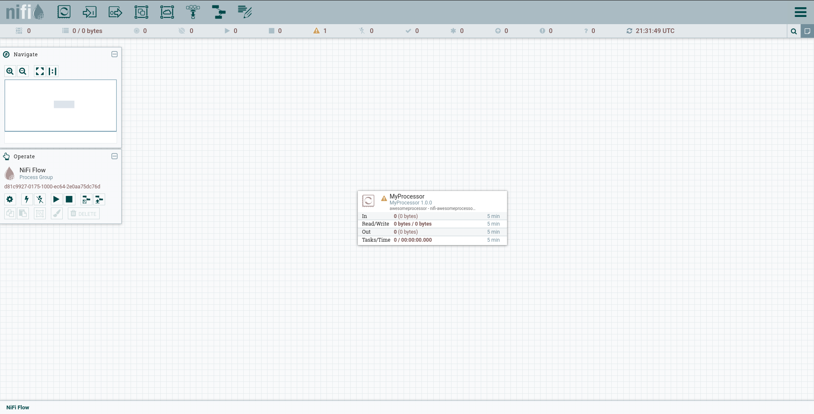

# Generate Docker Image with Custom Processors 

In this repository you find a simple Dockerfile based on **NIFI Image** and addictionally function to Copy my cystom processor, the Awesome Processor to lib Directory on **APACHE NIFI Docker Image**

# **Requirements**: 

1. JVM and Maven Installed on your computer. Used to build your custom processor

2. Docker Installed to run this custom Image


# Instructions to Run 

1. To build your custom image, first thing to do is build your processor: 
   - After you create a processor go to Pom of processor-nar directory and add this snippet to your pom file: 

```
    <properties>
        <buildDirectory>../../build</buildDirectory>
    </properties>

    <build>
        <plugins>
        <plugin>
            <groupId>org.apache.maven.plugins</groupId>
            <artifactId>maven-dependency-plugin</artifactId>
            <version>3.1.2</version>
            <executions>
            <execution>
                <id>copy-installed</id>
                <phase>install</phase>
                <goals>
                <goal>copy</goal>
                </goals>
                <configuration>
                <artifactItems>
                    <artifactItem>
                    <groupId>${project.groupId}</groupId>
                    <artifactId>${project.artifactId}</artifactId>
                    <version>${project.version}</version>
                    <type>${project.packaging}</type>
                    </artifactItem>
                </artifactItems>
                <outputDirectory>${buildDirectory}</outputDirectory>
                </configuration>
            </execution>
            </executions>
        </plugin>
        </plugins>
    </build>
```
   - This change is to Copy your nar file to build directory create on root folder 

   - Go to Processor folder, in my case is nifi-awesomeprocessor/, and run:  
   ```
   mvn clean install
   ```

   - Now your custom processor is built, and you able to create your custom docker Image. Run this code to build your image: 
    
    sudo docker build -t nifitest .
    
*obs: Depending on your system you need add sudo on beginning of this command to perform correctly*

   - In your terminal result is this: 

      


# Run your Image 

1. To run your image run this code: 

```
docker run -p 8080:8080 -d nifitest 
```
*obs: Depending on your system you need add sudo on beginning of this command to perform correctly*

 - The result in your terminal is like this: 
 
 

 - To see if your container is Up you can run this:

```
docker ps -a 
```
*obs: Depending on your system you need add sudo on beginning of this command to perform correctly*

The resulta like this: 


2. Now you can open your browse and go to http://localhost:8080/nifi/ and see your processor is ready to use: 

  


# To Use AWS Services 

1. Copy file credentials-example in aws-credentials folder and create a credentials file for aws 
2. Put your credentials in file and build a image to use aws Services on apache NIFI


